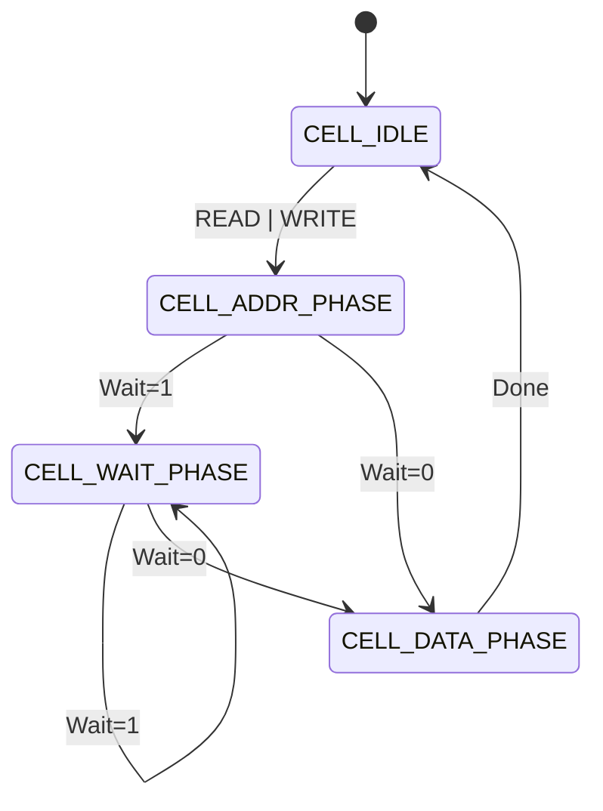
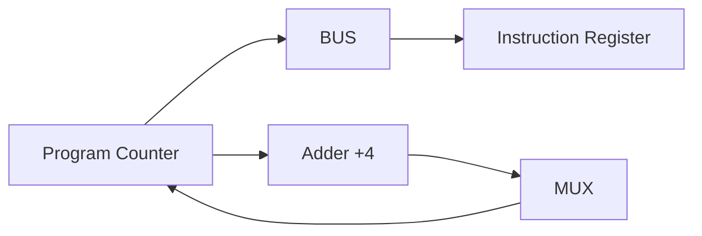

# Aurelia V2 Architecture - Hardware Specification

**(Revision 2.0 - Extended Technical Reference)**

## 1. System Bus Protocol (The Nervous System)

The Aurelia System Bus is a synchronous, master-slave interconnect handling 64-bit Address and Data transfers. It employs a "Ready/Wait" handshake protocol to accommodate devices of varying latencies.

### 1.1 Signal Definitions (Physical Layer)

The bus consists of the following discrete signal lines.

| Signal | Width | Direction (M->S) | Role | Electrical Logic |
|:---|:---:|:---:|:---|:---|
| **ADDR** | 64 | Out | Target Byte Address. | Active High. |
| **DATA** | 64 | Bi-dir | Payload. | Tri-state (Z-capable). |
| **READ** | 1 | Out | Initiate Read Cycle. | Active High (Strobe). |
| **WRITE**| 1 | Out | Initiate Write Cycle. | Active High (Strobe). |
| **WAIT** | 1 | In | Slave Busy Indication. | Active High (Open Drain). |
| **IRQ** | 1 | In | Interrupt Request. | Active High (Edge/Level). |
| **ERROR**| 1 | In | Bus Fault / NACK. | Active High. |

### 1.2 State Machine (Master Controller)

The Bus Controller follows a strict Mealy Machine.

### 1.3 Cycle-Accurate Timing

#### Read Transaction Waveform

1. **T0**: Master asserts `ADDR` and `READ`.
2. **T1**: Slave decodes address. Asserts `WAIT` (if latency > 0).
3. **T2..Tn**: `WAIT` remains High. Master holds lines stable.
4. **T_final**: Slave drives `DATA`. De-asserts `WAIT`.
5. **T_next**: Master latches data. De-asserts `READ`.

$$ Latency = T_{final} - T_0 $$

---

## 2. Microarchitecture (Classic RISC Pipeline)

The CPU implements a scalar, 3-stage pipeline.
Though simulated step-by-step, logically it operates as: **IF -> ID -> EX**.

### 2.1 Stage 1: Instruction Fetch (IF)

**Goal**: Retrieve the 32-bit instruction word from Memory at `PC`.

* **Micro-Ops**:
    1. `Bus.SetAddress(PC)`
    2. `Bus.SetControl(READ)`
    3. `Wait()` until Bus Ready.
    4. `IR (Instruction Register) ← Bus.Data`
    5. `NPC (Next PC) ← PC + 4`

### 2.2 Stage 2: Decode & Operand Fetch (ID)

**Goal**: Interpret `IR`, extract Register indices, and fetch values.

* **Logic Equations**:
  * $\text{Opcode} = IR[31:26]$
  * $R_d = IR[25:21]$
  * $R_n = IR[20:16]$
  * $R_m = IR[15:11]$
  * $\text{Imm}_{11} = IR[10:0]$
* **Sign Extension**:
  * If $\text{Imm}[10] == 1 \implies \text{SignExt} = \text{0xFF...F} | \text{Imm}$
  * Else $\implies \text{SignExt} = \text{Imm}$

### 2.3 Stage 3: Execute / Writeback (EX/WB)

**Goal**: Perform ALU operation and commit result.

* **ALU Multiplexer Logic**:
  * If `Type == Register` $\implies OpB = RegFile[Rm]$
  * If `Type == Immediate` $\implies OpB = \text{Imm}_{Extended}$
  * If `Type == Branch` $\implies OpB = \text{Offset}_{Extended}$

* **Hazard Handling Logic**:
  * In a 3-stage pipeline, Data Hazards are rare because WB happens at the end of the cycle.
  * **Control Hazards**: A Branch taken in EX flushes the IF stage (2-cycle penalty).
  * **Structural Hazards**: Unified Memory (Von Neumann) causes stalls if IF and Load/Store try to access bus simultaneously. (Aurelia prioritizes EX stage Load/Store, stalling Fetch).

---

## 3. Interrupt Controller (PIC) Specification

The Programmable Interrupt Controller (PIC) acts as a gateway for asynchronous events.

### 3.1 Interrupt Vector Logic

When `IRQ_LINE` is asserted and `IE (Interrupt Enable)` bit in `SR` is set:

1. **Context Save (Hardware)**:
    * `Stack[--SP] ← PC`
    * `Stack[--SP] ← SR`
2. **Vector Jump**:
    * `PC ← VectorBase + (IrqNumber * 4)`
    * (Currently simplified to fixed `0x00000004` vector)
3. **Mode Switch**:
    * `SR.IE ← 0` (Disable nested interrupts automatically)

### 3.2 Register Map (Base: 0xE0002000)

| Offset | Name | R/W | Description |
|:---:|:---|:---:|:---|
| 0x0 | `IRQ_STATUS` | R | **Pending Register**. Bit N is set if Source N is active. |
| 0x1 | `IRQ_ENABLE` | RW| **Mask Register**. Bit N=1 allows IRQ N to interrupt CPU. |
| 0x2 | `IRQ_ACK` | W | **Acknowledge**. Write-1-to-Clear. |
| 0x3 | `IRQ_MODE` | RW| **Trigger Config**. 0=Level, 1=Edge. |

**Priority Resolver Logic**:
The PIC uses a Fixed Priority scheme where IRQ 0 has the highest priority.
$$ \text{SelectedIRQ} = \text{CTZ}(\text{STATUS} \ \& \ \text{ENABLE}) $$
*(CTZ: Count Trailing Zeros)*

---

## 4. System Timer Specification

A 64-bit countdown timer driven by the system clock.

* **Map Base**: `0xE0003000`
* **Logic**:
  * Decrement internal `Counter` every tick.
  * If `Counter == 0`:
    * Assert `IRQ` Line.
    * Reload `Counter` from `ReloadValue` register.
* **Registers**:
  * `0x0`: Current Value.
  * `0x8`: Reload Value.
  * `0xC`: Control (Start/Stop).

---
**End of Specification.**
